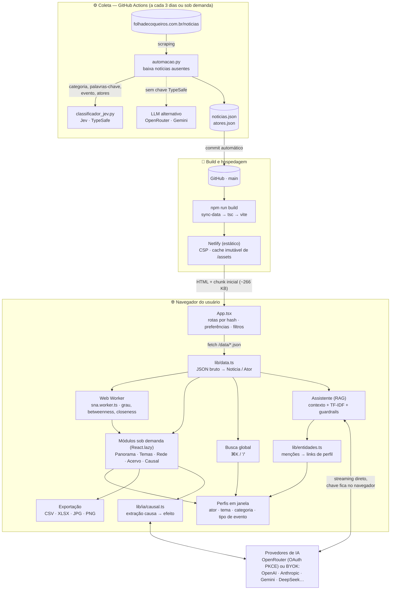

# 🗞️ Dashboard Analítico e IA — Folha de Coqueiros


Painel de inteligência territorial sobre o acervo histórico do jornal local **Folha de Coqueiros** (Florianópolis/SC). Combina análise de redes sociais, dinâmica de sistemas e IA generativa para revelar o panorama editorial, social e de infraestrutura do bairro.

> **Migração:** esta é a versão React + TypeScript + Vite, sucessora do painel original em Python/Streamlit. O pipeline Python de coleta e classificação (`automacao.py`, `classificador_jev.py`) segue sendo a fonte dos dados; o frontend consome os JSONs já processados. `Geral.py` e `api/` são legado da versão Streamlit.

---

## 🏗️ Arquitetura

O app não tem backend: um job agendado no GitHub coleta e classifica as notícias, grava JSONs no repositório e o Netlify publica um site estático. Todo o resto — métricas de rede, busca, perfis, exportação e IA — roda no navegador.



**Fluxo em uma frase:** `automacao.py` → JSONs no repositório → build do Netlify → o navegador carrega os dados, calcula a rede num Web Worker e conversa direto com o provedor de IA escolhido pelo usuário.

### Navegação

| Rota | Conteúdo |
|---|---|
| `#/` | Início, com os módulos e o resumo do acervo |
| `#/panorama` | KPIs, volume mensal (agregado ou por categoria), distribuição de categorias |
| `#/temas` | Nuvem de palavras e agenda de eventos (o antigo `#/eventos` redireciona para cá) |
| `#/rede` | Grafo de coocorrência e banco de atores com métricas SNA (o antigo `#/atores` redireciona para cá) |
| `#/acervo` | Todas as notícias enriquecidas, com filtros e links |
| `#/causal` | Mapa causal gerado por IA — fora do menu, acessível pelo endereço direto |

Cada módulo é um chunk separado, carregado só quando a rota é aberta; o assistente e a janela de perfis também são chunks próprios, e o do assistente é pré-carregado ao passar o mouse ou focar no botão que o abre.

---

## ✨ Os três pilares

### 1. 🕸️ Análise de Redes Sociais (SNA)
Grafo interativo de coocorrência entre atores (Pessoas, Organizações, Locais, Empresas) e entre palavras-chave, renderizado com **vis-network** e física Barnes-Hut estabilizada.

As métricas de SNA são calculadas **no browser, em TypeScript puro** (`src/lib/sna.ts`), replicando fielmente o comportamento padrão do NetworkX:

| Métrica | Algoritmo | Leitura |
|---|---|---|
| Grau | contagem de vizinhos | Com quantos atores divide notícias |
| Centralidade de grau | `grau / (n − 1)` | Grau normalizado |
| Betweenness | Brandes, escala `1 / ((n−1)(n−2))` | Papel de **ponte** entre grupos |
| Closeness | BFS + correção Wasserman-Faust | **Proximidade** média da rede inteira |

Os valores foram verificados contra o `networkx` original e batem até a 4ª casa decimal (`tests/sna.test.ts`, com referência em `tests/sna-referencia.ts`). O cálculo de todos os atores roda num **Web Worker** (`src/workers/sna.worker.ts`), ~9× mais rápido que a versão anterior e sem travar a interface.

### 2. 🔀 Diagrama de Enlace Causal (CLD)
Página fora do menu (`#/causal`). Sob demanda, a IA lê as notícias filtradas e extrai pares **causa → efeito** com polaridade e evidência textual, renderizados com **React Flow** e layout hierárquico via **dagre**:

* **Verde** — enlace de reforço (`increase`, +)
* **Vermelho** — enlace de balanço (`decrease`, −)

Cada relação carrega o trecho literal que a sustenta, exposto numa caixa retrátil de transparência (incluindo o JSON bruto).

### 3. 💬 Assistente Editorial (RAG)
Chatbot que responde sobre todo o acervo e os indicadores do painel, citando as fontes. O usuário conecta a própria IA, de duas formas:

* **Login OpenRouter (principal)** — OAuth PKCE, sem copiar chaves. Padrão: `openrouter/free` (roteador de modelos gratuitos); um seletor com busca dá acesso a todos os modelos do OpenRouter.
* **Chave própria (BYOK)** — OpenAI, Anthropic, Google Gemini, DeepSeek, Groq, Mistral, xAI, Together, Fireworks, Cerebras, Perplexity, Cohere e Moonshot.

As chamadas vão **direto do navegador ao provedor**: não há backend, e a chave nunca passa por servidores da Folha. Ela fica na `sessionStorage` (ou `localStorage`, se o usuário marcar "manter conectado"). A mesma conexão alimenta o mapa causal.

Atores, temas, categorias e tipos de evento citados nas respostas viram **links para os perfis** (`src/lib/entidades.ts`): a detecção é determinística, por dicionário do acervo, então funciona com qualquer modelo — inclusive dentro de tabelas.

O contexto combina agregados do acervo completo e do recorte filtrado (categorias, volume mensal/anual, eventos, termos, palavras-chave), rankings de SNA, pares de atores mais conectados e recuperação TF-IDF sobre todas as notícias.

**Guardrails** (`src/lib/ia/guardrails.ts`, testados em `tests/`):
* entrada: limite de tamanho, intervalo mínimo entre envios, remoção de caracteres invisíveis e bloqueio de CPF, cartão (Luhn) e chaves de API;
* injeção de prompt: detecção heurística + aviso explícito ao modelo; o acervo entra delimitado e higienizado como *dado*;
* prompt de sistema com regras de escopo, ética, privacidade, neutralidade política e proibição de inventar fatos ou URLs;
* saída: canário secreto que derruba respostas que vazem as instruções; links fora das fontes enviadas aparecem como "link não verificado";
* transparência (ISO/IEC 42001): aviso de IA aceito antes da primeira mensagem, rótulo "Gerado por IA · modelo" em cada resposta;
* deploy: Content-Security-Policy com `connect-src` restrito aos provedores suportados e sem scripts inline.

Testes: ver [Testes](#5-testes).

### Também no painel
* **Busca global** — `⌘K` / `Ctrl+K` ou `/` no cabeçalho: atores, palavras-chave, notícias e categorias de todo o acervo, sem acento e sem diferenciar maiúsculas
* **Perfis** — janela com série temporal de citações, assuntos, conexões, temas, eventos e notícias de cada ator, tema, categoria ou tipo de evento; clicáveis em todo o painel
* **Exportação** — tabelas em CSV/XLSX e gráficos em JPG (com fundo) ou PNG (sem fundo), gerados no navegador e sem dependências
* **KPIs e volume temporal** — agregado ou empilhado por categoria (Recharts)
* **Nuvem de palavras** — clicável, abre o perfil do tema
* **Agenda de eventos** — tipos, pagos vs. gratuitos e tabela detalhada
* **Banco de atores** — tabela ordenável e paginada (TanStack Table)
* **Acervo enriquecido** — base completa com filtros e links diretos
* **Preferências** — tema claro/escuro, tamanho de fonte, alto contraste e movimento reduzido, aplicados antes da primeira pintura

### Desempenho e acessibilidade
* **Code-splitting** por módulo: o JS inicial caiu de 1,7 MB para 266 KB
* **Error boundaries** por área (`LimiteErro.tsx`): uma falha no grafo não derruba o resto
* **WCAG 2.1 AA**: hierarquia de títulos, foco preso em diálogos, live regions e link de pular para o conteúdo

---

## 🛠️ Stack

| Camada | Tecnologia |
|---|---|
| Build | Vite + TypeScript (`strict`) |
| UI | React 19, Tailwind CSS, Lucide |
| Redes | vis-network + vis-data |
| Diagrama causal | @xyflow/react (React Flow) + dagre |
| Gráficos | Recharts |
| Tabelas | @tanstack/react-table |
| IA | OpenRouter (OAuth PKCE) ou BYOK, direto do navegador — sem backend |
| Concorrência | Web Worker (métricas SNA) |
| Testes | Vitest, axe-core, unittest (Python) |
| Hospedagem | Netlify (estático) |

---

## 🚀 Instalação e execução

### 1. Dependências
```bash
npm install
```

### 2. Desenvolvimento
```bash
npm run dev
```
Abra <http://localhost:5174>. Não há chaves a configurar: a IA é conectada por cada usuário no próprio assistente (o login OpenRouter funciona em `localhost`).

### 3. Build de produção
```bash
npm run build
```
Para testar o `dist/` como o Netlify o serve (brotli/gzip, cabeçalhos do `netlify.toml`, CSP e fallback de SPA) — útil para Lighthouse:
```bash
node scripts/servir-producao.mjs
```

### 4. Coleta automática (a cada 3 dias)

O workflow [`coleta_noticias.yml`](.github/workflows/coleta_noticias.yml) roda `automacao.py` a cada 3 dias (06:00 de Brasília) e também sob demanda (**Actions → Coleta e classificação de notícias → Run workflow**):

1. **Coleta** — compara a listagem do site com o banco e baixa toda notícia ausente.
2. **IA** — numa chamada por notícia, classifica (categoria, palavras-chave, evento) e extrai os atores; também recupera pendências antigas, até `LIMITE_IA` (40) por execução.
   O classificador principal é o **Jev** ([TypeSafe](https://docs.typesafe.ai)), em [`classificador_jev.py`](classificador_jev.py). Como o Jev devolve julgamentos tipados em vez de texto, o código acha candidatos no texto (datas, horários, valores, locais, nomes próprios, termos do vocabulário do acervo) e o Jev escolhe entre eles — numa única requisição por notícia. Categoria, evento e gratuidade são perguntas `Choice`/`Noul` diretas; datas relativas ("sábado", "dia 13") são resolvidas em código a partir da data de publicação.
3. **Salva** — atualiza `noticias.json`/`atores.json` na raiz e em `public/data/`, e faz o commit (o Netlify publica em seguida).

Configure em **Settings → Secrets and variables → Actions**:

| Nome | Tipo | Uso |
|---|---|---|
| `TYPESAFE_API_KEY` | secret | Recomendado: classificação com Jev. |
| `JEV_MODELO` | variable | Opcional: fixa uma versão (padrão `jev-latest`). |
| `OPENROUTER_API_KEY` | secret | Alternativa por LLM, padrão `openrouter/free` (gratuito). |
| `GEMINI_API_KEY` | secret | Alternativa por LLM, usada só sem as anteriores. |
| `IA_MODELO` / `IA_CLASSIFICADOR` | variable | Opcional: modelo do LLM; `llm` força o LLM mesmo com a chave TypeSafe. |

Se a IA falhar (chave inválida, cota), a coleta é salva mesmo assim e o workflow fica **vermelho** — o GitHub avisa por e-mail. Localmente: `python automacao.py --sem-ia` só coleta. O `npm run build` sincroniza `public/data` automaticamente (`prebuild`).

### 5. Testes

```bash
npm test                                   # 100 testes: guardrails, streaming, contexto, rodadas, Markdown, SNA, busca, perfis, exportação
python3 -m unittest tests/test_automacao.py tests/test_classificador_jev.py  # coleta e classificação (Jev)
IA_CHAVE=sk-or-v1-… npm run avaliar        # avaliação ao vivo do assistente (gera relatorio-avaliacao.md)
```

A avaliação ao vivo faz 14 perguntas a um modelo real e confere as respostas contra os dados: números corretos, fontes verificadas, recusa fora do escopo, resistência a injeção (direta e escondida numa notícia), alucinação, neutralidade política, identidade de IA, idioma e respostas longas com tabela. Variáveis: `IA_PROVEDOR` (padrão `openrouter`) e `IA_MODELO` (padrão `openrouter/free`).

---

## 📂 Estrutura do projeto

```text
├── public/
│   ├── preferencias.js        # Aplica tema/fonte antes da 1ª pintura
│   └── data/                  # Datasets servidos ao browser
│       ├── noticias.json
│       └── atores.json
├── scripts/
│   ├── sync-data.mjs          # Copia os JSONs da raiz para public/data
│   └── servir-producao.mjs    # Serve dist/ como o Netlify (compressão, CSP)
├── tests/                     # Vitest (TS) + unittest (coleta Python)
├── automacao.py               # Coleta + classificação (GitHub Actions, a cada 3 dias)
├── classificador_jev.py       # Classificação com Jev (TypeSafe)
├── src/
│   ├── components/
│   │   ├── Navbar.tsx
│   │   ├── BuscaGlobal.tsx    # Busca ⌘K por todo o acervo
│   │   ├── PerfilModal.tsx    # Perfis de ator, tema, categoria, tipo de evento
│   │   ├── MenuBaixar.tsx     # Download CSV/XLSX/JPG/PNG
│   │   ├── TabelaDados.tsx    # Tabela base (ordenação, paginação, exportação)
│   │   ├── Popover.tsx
│   │   ├── LimiteErro.tsx     # Error boundary por área
│   │   ├── FiltersDrawer.tsx
│   │   ├── SettingsMenu.tsx   # Tema, fonte, contraste, movimento
│   │   ├── FundoAnimado.tsx   # Rede animada de fundo (canvas)
│   │   ├── SeletorModelo.tsx  # Combobox de modelos de IA
│   │   ├── MetricsOverview.tsx
│   │   ├── WordCloud.tsx
│   │   ├── EventsPanel.tsx
│   │   ├── NetworkGraph.tsx   # vis-network + painel de controle flutuante
│   │   ├── CausalDiagram.tsx  # React Flow + dagre
│   │   ├── ActorsTable.tsx
│   │   ├── NewsTable.tsx
│   │   ├── ChatbotDrawer.tsx
│   │   ├── Markdown.tsx       # Renderizador markdown seguro
│   │   └── SocialIcons.tsx
│   ├── hooks/
│   │   ├── useNetworkData.ts  # Construção do grafo + métricas SNA
│   │   └── useAssistente.ts   # Estado da conversa na interface
│   ├── workers/
│   │   └── sna.worker.ts      # Métricas SNA fora da thread principal
│   ├── pages/                 # Início e páginas de módulo
│   ├── lib/
│   │   ├── ia/
│   │   │   ├── provedores.ts  # Catálogo, listagem de modelos
│   │   │   ├── cliente.ts     # Streaming OpenAI/Anthropic/Gemini
│   │   │   ├── openrouter.ts  # Login OAuth PKCE
│   │   │   ├── conexao.tsx    # Estado da conexão (React context)
│   │   │   ├── contexto.ts    # Prompt de sistema + RAG
│   │   │   ├── conversa.ts    # Uma rodada do assistente, sem React
│   │   │   ├── guardrails.ts
│   │   │   └── causal.ts      # Extração do mapa causal
│   │   ├── data.ts            # Carregamento e normalização dos JSONs
│   │   ├── sna.ts             # Brandes, closeness, coocorrência
│   │   ├── busca.ts           # Índice e casamento da busca global
│   │   ├── perfil.ts          # Agregados de cada perfil
│   │   ├── perfis.tsx         # Contexto para abrir perfis de qualquer lugar
│   │   ├── entidades.ts       # Menções do assistente → links de perfil
│   │   ├── exportar.ts        # CSV, XLSX (OOXML mínimo) e imagens
│   │   ├── rotas.ts           # Roteamento por hash e catálogo de módulos
│   │   ├── precarregar.ts     # Imports dos chunks sob demanda
│   │   ├── preferencias.tsx   # Tema, fonte, contraste, movimento
│   │   └── constantes.ts
│   ├── types/index.ts
│   ├── App.tsx
│   └── main.tsx
├── netlify.toml
└── vite.config.ts
```

### Nota sobre os dados

O acervo foi produzido por um pipeline que evoluiu ao longo do tempo, então o JSON bruto é heterogêneo: campos booleanos aparecem ora como `true`, ora como a string `"True"`; ausências aparecem como `null`, `"None"` ou `"N/A"`. Por isso `src/lib/data.ts` separa o formato **bruto** (`NoticiaRaw`) do **normalizado** (`Noticia`) — nenhum componente toca no dado cru.

---

## 👨‍💻 Desenvolvedor

Desenvolvido por **Gustavo Simas**, mesclando as fronteiras do jornalismo local, engenharia de dados e inteligência artificial.

[](https://github.com/gsimas/)
[](https://www.linkedin.com/in/simasgs/)
[](https://medium.com/@tudoemsimas)
